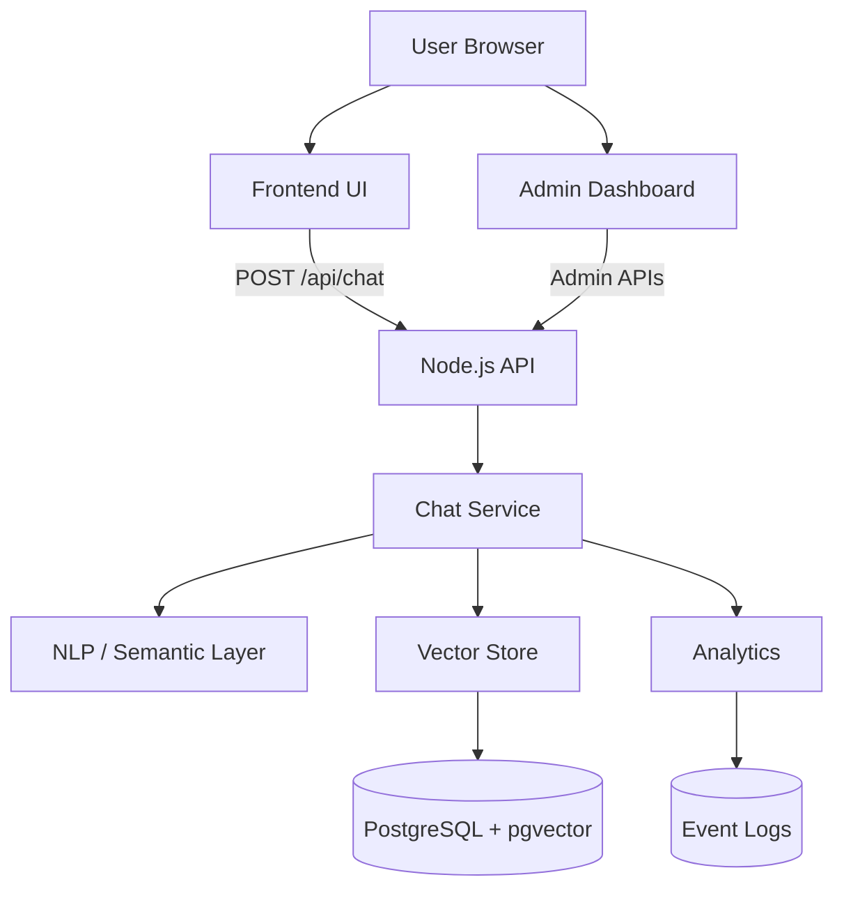

<p align="center">
  
</p>

<h1 align="center">🚀 OrbMitra</h1>

<p align="center">
  AI-powered chatbot platform for intelligent learning & semantic search
</p>

<p align="center">
  
  
  
</p>
# 🚀 OrbMitra


OrbMitra is an **AI-powered chatbot platform** designed for intelligent Q&A, semantic search, and real-time analytics.

Built as the core chatbot system for **BugOrbit**, it enables users to interact with a knowledge base using natural language.

---

## ✨ Key Features

* 🤖 AI chatbot for instant answers
* 🧠 Semantic search using vector embeddings
* 📊 Real-time analytics & feedback tracking
* 🔐 Admin dashboard with live monitoring
* ⚡ Scalable Node.js backend
* 🐘 PostgreSQL + pgvector integration
* 🐳 Docker-based local setup

---

## 📸 Preview

<p align="center">
  
</p>

<p align="center">
  
</p>


---

## ⚡ Quick Start

```bash
git clone https://github.com/your-username/orbmitra.git
cd orbmitra

# setup env
cp backend/.env.example backend/.env

# install dependencies
npm install

# start backend
npm start

# start frontend (in another terminal)
npm run frontend
```

Open:

```
http://localhost:5173
```

Admin:

```
http://localhost:5173/admin
```

---

## 🏗️ Architecture Overview



---

## 📂 Project Structure

```
orbmitra/
 ├── frontend/        # UI (chat + admin)
 ├── backend/         # API + AI logic + DB
 ├── docs/            # screenshots, diagrams
 ├── .env.example
 ├── docker-compose.yml
 └── README.md
```

---

## 🔧 Environment Variables

Create `.env` from example:

```bash
cp backend/.env.example backend/.env
```

Example:

Set `ADMIN_JWT_SECRET` to a long random value before starting the backend.

```
PORT=3000
FRONTEND_PORT=5173
API_BASE=http://localhost:3000

USE_POSTGRES=true

ENABLE_ANALYTICS=true
ADMIN_JWT_SECRET=replace-with-a-long-random-secret
ADMIN_COOKIE_NAME=orbmitra_admin_token
ADMIN_COOKIE_SAME_SITE=Strict
ADMIN_TOKEN_TTL_SECONDS=28800
ADMIN_LOGIN_MAX_ATTEMPTS=5
ADMIN_LOGIN_WINDOW_SECONDS=900
ADMIN_LOGIN_LOCKOUT_SECONDS=900
ADMIN_PASSWORD_ITERATIONS=310000
POSTGRES_HOST=localhost
POSTGRES_PORT=5432
POSTGRES_DB=orbmitra
POSTGRES_USER=orbmitra
POSTGRES_PASSWORD=change-me
VECTOR_TABLE=knowledge_embeddings
FEEDBACK_TABLE=chat_feedback
```

---

## 🐳 Docker Setup

Start full stack:

```bash
docker compose up -d
```

Run DB schema:

```bash
Get-Content .\backend\sql\schema.sql | docker compose exec -T db psql -U orbmitra -d orbmitra
```

---

## 🔍 Deep Dive (Architecture & Internals)

### Backend

* `app.js` → API routes + initialization
* `chat-service.js` → main chatbot logic
* `semantic/` → embeddings + intent detection
* `db/` → PostgreSQL + vector search
* `analytics/` → event tracking

### Flow

```
User → Frontend → API → Chat Service → NLP → Vector Search → Response
```

### Features

* Hybrid scoring (semantic + keyword)
* Intent detection (Selenium, API, Java, etc.)
* Real-time analytics via events
* Admin dashboard for monitoring

---

## 📡 API Endpoints

* `/api/health`
* `/api/chat`
* `/api/stats`
* `/api/quiz`
* `/api/admin/events`
* `/api/admin/database`

---

## 🚀 Vision

OrbMitra aims to evolve into a full **AI-powered learning platform**, similar to W3Schools/JavaTpoint—but smarter, conversational, and personalized.

---

## 🤝 Contributing

Contributions are welcome.
Please read [CONTRIBUTING.md](CONTRIBUTING.md) before sending a pull request.

Security issues should be reported privately. See [SECURITY.md](SECURITY.md).

---

## 📄 License

This project is licensed under the MIT License.

## Deployment

OrbMitra is designed to run as two services plus PostgreSQL:

- backend API: `node backend/src/server.js`
- frontend UI: `node frontend/src/server.js`
- database: PostgreSQL with pgvector

Production checklist:

- set a strong `ADMIN_JWT_SECRET`
- use a managed PostgreSQL database or a hardened container volume
- keep `USE_POSTGRES=true`
- set `FRONTEND_ORIGIN` to the public frontend URL
- set `API_BASE` to the public backend URL
- ensure HTTPS is enabled in production
- if the frontend and backend are on different sites, set `ADMIN_COOKIE_SAME_SITE=None` and keep `Secure` enabled

For Docker or container hosts, use `backend/.env.example` as the baseline and override only the environment variables that differ per environment.
